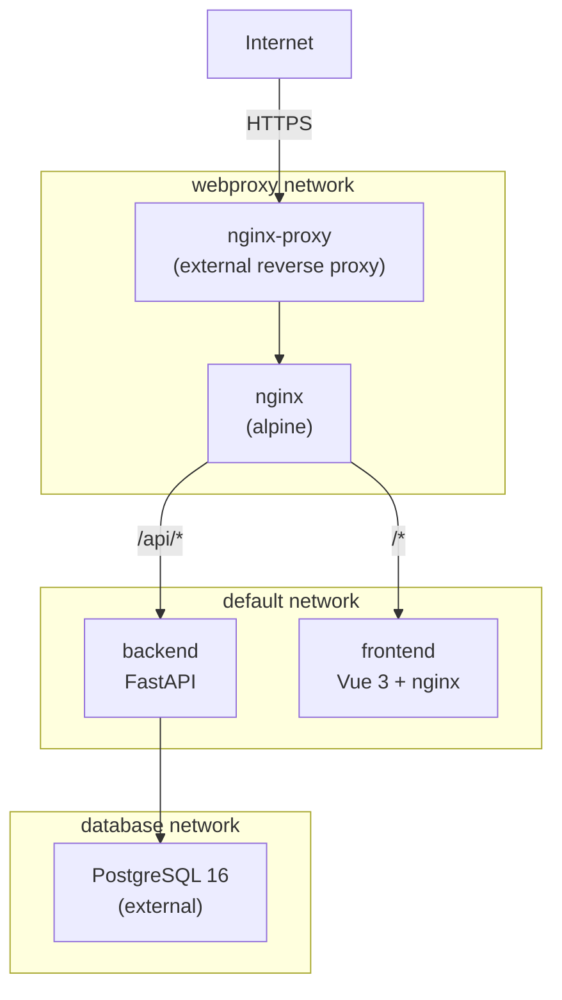

# VEAF Website — Deployment Guide

Deploy the VEAF website from pre-built Docker images.

## Prerequisites

- **Docker** and **Docker Compose** (v2+)
- **PostgreSQL 16** database, accessible from a Docker network
- **External reverse proxy** (e.g. [nginx-proxy](https://github.com/nginx-proxy/nginx-proxy)) on a Docker network named `webproxy`

## Network Setup

The compose file expects two external Docker networks. Create them if they don't exist:

```bash
docker network create webproxy    # reverse proxy network
docker network create database    # shared network with your PostgreSQL instance
```

Your PostgreSQL container (or host) must be attached to the `database` network so the backend can reach it.

## Getting the Deployment Files

You don't need to clone the entire repository. Use Git sparse checkout to fetch only the `deploy/` directory:

```bash
# From the main branch (default)
git clone --no-checkout --depth 1 https://github.com/VEAF/website-2026.git veaf-deploy

# Or from a specific branch/tag
git clone --no-checkout --depth 1 --branch v1.0.0 https://github.com/VEAF/website-2026.git veaf-deploy

cd veaf-deploy
git sparse-checkout set deploy
git checkout
cd deploy
```

## Quick Start

```bash
# 1. Copy and edit the environment file
cp backend.env.dist backend.env
# Edit backend.env — at minimum set DATABASE_URL and JWT_SECRET

# 2. Pull images and start
./start.sh
```

Migrations run automatically on startup when `RUN_MIGRATIONS=true` is set in `backend.env` (default in `backend.env.dist`).

The application is now running. The nginx service is exposed to the `webproxy` network with `VIRTUAL_HOST` set (default: `veaf.org`). Your reverse proxy should pick it up automatically.

### Helper Scripts

| Script | Description |
|---|---|
| `./start.sh` | Start all services |
| `./stop.sh` | Stop all services |
| `./update.sh` | Pull latest images and restart services |
| `./console.sh <cmd>` | Run a backend CLI command (e.g. `./console.sh database create`) |

## Configuration

### Environment Variables

All backend configuration is in `backend.env`. See `backend.env.dist` for the full list with descriptions.

| Variable | Required | Description |
|---|---|---|
| `DATABASE_URL` | Yes | PostgreSQL connection string (asyncpg) |
| `JWT_SECRET` | Yes | Secret key for JWT tokens — use a long random string |
| `APP_URL` | Yes | Public URL of the application |
| `MAIL_SERVER` | No | SMTP server for outgoing emails |
| `DISCORD_CLIENT_ID` | No | Discord OAuth2 client ID |
| `DISCORD_CLIENT_SECRET` | No | Discord OAuth2 client secret |
| `DISCORD_BOT_TOKEN` | No | Discord bot token — enables voice channel display (see below) |
| `DISCORD_GUILD_ID` | No | Discord server (guild) ID — required with `DISCORD_BOT_TOKEN` |
| `RECAPTCHA_SECRET_KEY` | No | Google reCAPTCHA v3 secret |

### Compose Variables

These can be set in a `.env` file next to `docker-compose.yml` or exported in your shell:

| Variable | Default | Description |
|---|---|---|
| `TAG` | `latest` | Docker image tag to use |
| `VIRTUAL_HOST` | `veaf.org` | Hostname for reverse proxy auto-discovery |

### Discord Bot (Voice Channels)

To display active users in Discord voice channels on the website:

1. In the [Discord Developer Portal](https://discord.com/developers/applications), select your application
2. Under **Bot**: generate a token and enable **Server Members Intent** and **Presence Intent**
3. Invite the bot to your server (scope: `bot`, no special permissions needed)
4. Set the variables in `backend.env`:

```env
DISCORD_BOT_TOKEN=your-bot-token
DISCORD_GUILD_ID=123456789012345678
```

The backend will poll the Discord API every 5 minutes. If these variables are not set, the feature is simply disabled.

## Updating

```bash
./update.sh
```

This pulls the latest images and restarts services. Migrations run automatically on startup.

## Architecture



## Troubleshooting

**Backend won't start** — Check `docker compose logs backend`. Most common issue: database not reachable. Verify `DATABASE_URL` and that the `database` network is correctly set up.

**502 Bad Gateway** — The backend may still be starting. Wait for the health check to pass: `docker compose ps` should show `healthy` status.

**Migrations fail** — Ensure the database user has CREATE/ALTER privileges on the target database.
